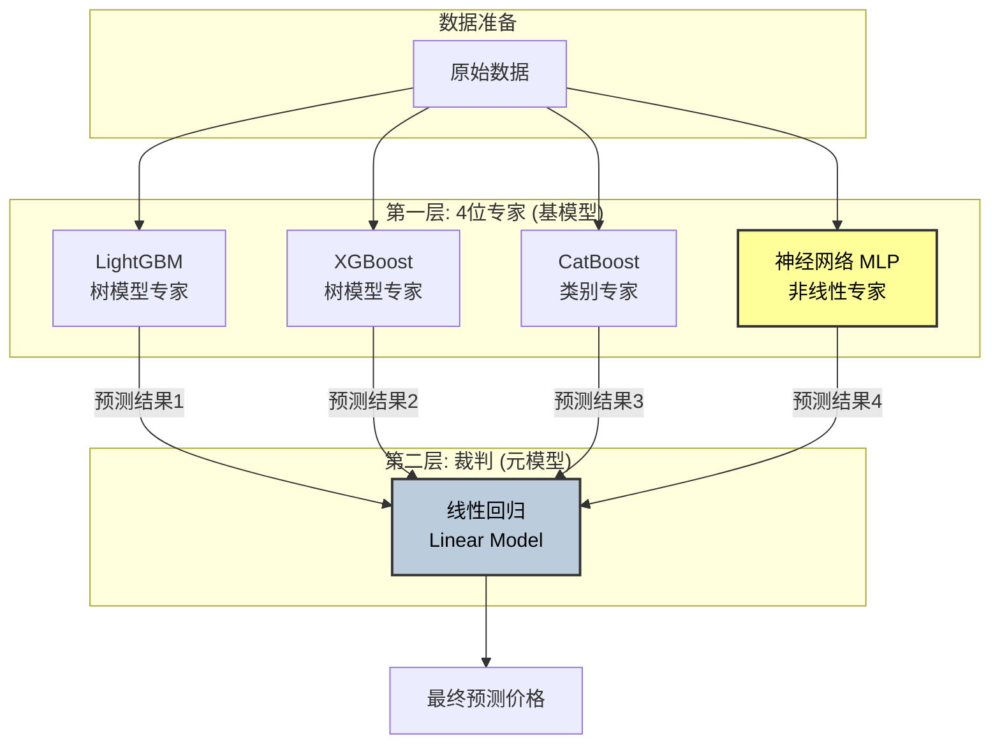

# 冲刺方案: 目标 MAE < 400

## 当前状态
- **Best Score**: 445.68 (LGB+XGB+CatBoost Weighted Blend)
- **Target**: < 400
- **Gap**: ~45 分

## 核心策略 (Stacking & Deep Learning)

为了突破树模型的瓶颈，我们需要引入差异化更大的模型（神经网络）和更高级的融合策略（Stacking）。

### Architecture Diagram

### 1. 引入神经网络 (NN Model)
树模型擅长处理分段函数，而神经网络擅长处理连续函数和嵌入表示。
- **架构**: 简单 MLP (多层感知机)
  - Input -> Embedding Layer (Brand/Model/Region) -> Dense Layers (256-128-64) -> Output
- **特征**: 
  - 数值特征: 标准化 (StandardScaler)
  - 类别特征: Embedding
- **工具**: 推荐使用 PyTorch (如未安装则用 sklearn MLP)

### 2. Stacking 融合 (Meta-Learner)
不再使用简单的加权平均，而是训练一个元模型来学习基模型的偏差。
- **Layer 1 (Base Models)**:
  - LightGBM (已训练) -> OOF Predictions
  - XGBoost (已训练) -> OOF Predictions
  - CatBoost (已训练) -> OOF Predictions
  - **[NEW] Neural Network** -> OOF Predictions
- **Layer 2 (Meta Model)**:
  - 输入: Layer 1 的 4 个 OOF 预测值
  - 模型: BayesianRidge 或 LinearRegression (防止过拟合)
  - 输出: 最终预测

## 实施步骤

1.  **环境准备**: 检查 `pytorch` 可用性。
2.  **NN 训练**: 
    - 编写 `train_nn.py`。
    - 训练并生成 NN 的 OOF 和 Test 预测。
3.  **Stacking**:
    - 编写 `stacking.py`。
    - 读取所有 OOF 和 Test 预测。
    - 训练 Meta Model 并生成最终提交 `predictions_stacking.csv`。

## 验证计划
- **Step 1**: NN 单模型 MAE < 500 (证明有效)。
- **Step 2**: Sacking CV MAE < 440。
- **Step 3**: 线上提交，目标 < 400。
